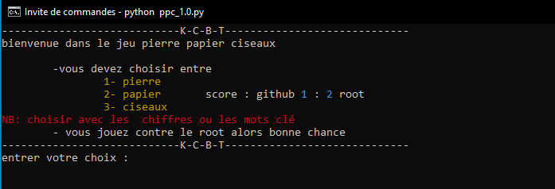

# **__game_python__**

different jeux console conçu en python:)

## **de.py**

jeu de DE a jouer a deux ou trois personne

<strong >apercu</strong> 

 

 
 ## **pierre papier ciseau**

ce jeu n'a plus besion d'être present contrairement au précédent presenter lui ce jour a seul contre IA
> `je me demande si vous avez une chance de le battre`

> `deux version sont disponible actuellement pour cette rubrique`
1.  premiere version **ppc_1.0.py**

<strong >apercu</strong> 

 

 
2. second version <strong>ppc_1.1.py</strong>

<strong >apercu</strong> 

 

## **casino**

ce jeux consite a mise pour gagner 
> je vous en dit pas plus aller le tester `PS : c'est mon préféré`  
nom du fichier : **jeu.py**
# **Ce Depot**

> **__Toute amélioration sera la `BIENVENUE`__**

> **Statut : `en cours`**
